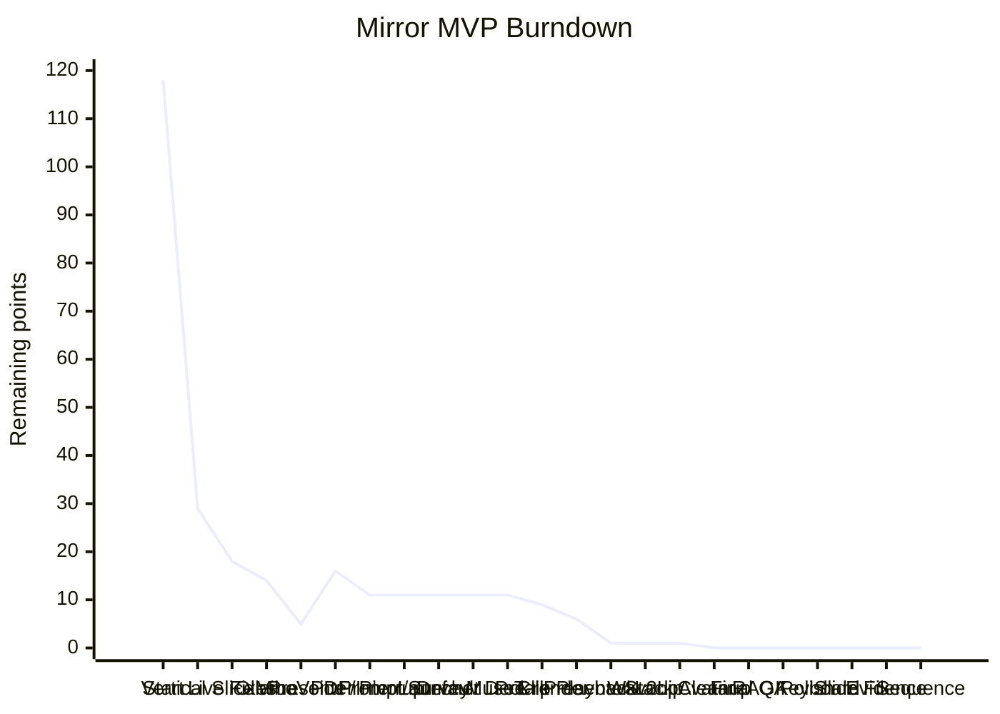

# Burndown

Last updated: 2026-05-04

Initial scope: 118 points
Current scope: 197 points

## Remaining Points

| Session | Completed This Session | Remaining | Notes |
| --- | ---: | ---: | --- |
| Start | 0 | 118 | Plan accepted. |
| Scaffold + Backend + Frontend vertical slice | 89 | 29 | App compiles and backend smoke tests pass. |
| Live listening + avatar/STT fixes | 11 | 18 | Default avatar served, live STT loop added, `faster-whisper` installed. |
| Ollama Gemma 4 connected | 4 | 14 | Ollama installed, `gemma4:e2b` pulled, API moved to fresh port `8001`. |
| VibeVoice + image controls | 9 | 5 | Official VibeVoice WebSocket connected; avatar image zoom/position controls render. |
| Lightweight research presenter pivot | 12 | 16 | VibeVoice disabled, Windows SAPI default, prompt tuning, slide-control MVP, mouth-patch photo warp, active API moved to `8002`. Scope increased by 23pt. |
| PDF slides + interruption | 10 | 11 | Image coordinate fix, speech interrupt, PDF upload/summarize/select. Scope increased by 5pt. |
| Prompt + avatar method survey | 0 | 11 | Fixed the slide narration prompt file and documented realistic talking-head options. |
| Double-click launcher | 1 | 11 | Added `Start-Mirror.bat` plus API/Web helper launch scripts. Scope increased by 1pt. |
| Default deck + MuseTalk route | 3 | 11 | General Meeting PDF/JSON auto-loads as the default deck; MuseTalk selected as avatar engine. Scope increased by 3pt. |
| MuseTalk setup + render API | 11 | 11 | Installed MuseTalk, downloaded weights, smoke-tested demo, added speech cache and render API. Scope increased by 11pt. |
| General Meeting pre-render entry point | 2 | 9 | Added batch script, npm command, and manifest generation. Full 26-slide render intentionally not run. |
| Frontend MuseTalk playback | 3 | 6 | Avatar stage overlays MuseTalk MP4 clips; slide Explain reads prepared narration and reuses cached clips. |
| In-app presenter loop | 5 | 1 | Slide PDF preview, presenter PiP, slide-action interrupt, and idle narration/Q&A loop. Scope increased by 0pt; this consumed existing slide verification/tuning work. |
| PDF renderer + Wav2Lip switch | 10 | 1 | Added server-rendered slide PNGs and replaced default avatar engine with Wav2Lip. Scope increased by 10pt. |
| Stack-chan avatar pivot | 5 | 1 | Dropped photoreal lip sync from the default flow, added lightweight robot avatar, and removed per-slide Q&A pauses. Scope increased by 5pt. |
| Stable build cleanup | 1 | 0 | Removed heavy experiment folders, stale logs/caches, unused avatar photo assets, active scripts, dependency declarations, and docs. Scope increased by 1pt. |
| Final Q&A countdown | 2 | 0 | Added a 3-minute final-slide Q&A window with countdown drawing. Scope increased by 2pt. |
| Evidence RAG + polish | 9 | 0 | Added ranked slide evidence, evidence-only answer context, slide preloading, and more active Stack-chan motion. Scope increased by 9pt. |
| Keyboard chat input | 3 | 0 | Added typed conversation input that shares the voice-input RAG and playback flow. Scope increased by 3pt. |
| Chat slide-jump fix | 1 | 0 | Stopped evidence search from sending slideshow start keys and preserved the current slide on no-match queries. Scope increased by 1pt. |
| Evidence display lock | 1 | 0 | Made the primary evidence slide drive the visible slide image and notes during Q&A. Scope increased by 1pt. |
| Sequential evidence + wait avatar | 4 | 0 | Added answer-time evidence slide sequencing, centered Stack-chan Q&A wait state, and immediate auto narration advance. Scope increased by 4pt. |

## Time Log

| Session | Approx Time | Notes |
| --- | ---: | --- |
| Scaffold + Backend + Frontend vertical slice | 2.5h | Project structure, core API, React UI, smoke tests. |
| Live listening + avatar/STT fixes | 1.5h | Continuous listening, default avatar, backend Whisper setup. |
| Ollama Gemma 4 connected | 1.0h | Ollama install, `gemma4:e2b` pull, API move to port `8001`. |
| VibeVoice + image controls | 1.7h | Official VibeVoice install/connect, initial image control fixes. |
| Lightweight research presenter pivot | 0.8h | Disable VibeVoice, SAPI/VOICEVOX adapter, prompt controls, slide endpoint, mouth-patch warp. |
| PDF slides + interruption | 0.9h | Canvas coordinate fix, request/playback interrupt, PDF page extraction, slide matching. |
| Prompt + avatar method survey | 0.1h | Slide narration prompt repair, talking-head method survey, implementation recommendation. |
| Pre-generated avatar runtime plan | 0.1h | Documented idle loop plus viseme asset strategy for fast local playback. |
| Double-click launcher | 0.1h | Added launcher batch file and helper cmd scripts. |
| Default deck + MuseTalk route | 0.3h | Moved General Meeting assets, added startup deck loading, selected MuseTalk route, verified API/build/tests. |
| MuseTalk setup + render API | 0.8h | Installed MuseTalk dependencies/weights, ran demo inference, added Mirror render/cache endpoints, verified MP4 output. |
| General Meeting pre-render entry point | 0.2h | Added range-limited PowerShell batch driver, npm script, docs, and dry-run verification. |
| Frontend MuseTalk playback | 0.2h | Added cached MP4 overlay, prepared slide Explain action, one-page cached render verification. |
| In-app presenter loop | 0.5h | Added slide PDF preview, presenter PiP, old-mouth interrupt on slide action, and idle narration/Q&A loop. |
| PDF renderer + Wav2Lip switch | 1.1h | Added PyMuPDF PNG rendering, Wav2Lip setup/smoke/API integration, frontend proxy fix, and browser verification. |
| Stack-chan avatar pivot | 0.4h | Added lightweight robot avatar, removed Wav2Lip from the active frontend path, simplified idle slide narration, and verified browser/build/tests. |
| Stable build cleanup | 0.4h | Removed heavy experiment folders, stale logs/caches, unused avatar photo assets, scripts/docs, package references, and updated docs. |
| Final Q&A countdown | 0.3h | Added final-slide countdown state, on-slide ring UI, loop reset, and build/test verification. |
| Evidence RAG + polish | 0.8h | Added backend ranked candidates, evidence-only answer context, evidence UI, slide image preloading, and livelier Stack-chan animation. |
| Keyboard chat input | 0.3h | Added chat composer, typed-message handler, shared RAG/TTS path, and build/test verification. |
| Chat slide-jump fix | 0.2h | Disabled auto-show for evidence search, added current-page fallback, and verified through API/Vite proxy. |
| Evidence display lock | 0.2h | Prioritized primary evidence slide for the visible slide image and notes, and cleared evidence when auto narration resumes. |
| Sequential evidence + wait avatar | 0.5h | Added answer playback slide sequencing, centered question-waiting Stack-chan, immediate post-speech advance, and verification. |

## Point Ledger

| ID | Points | Status |
| --- | ---: | --- |
| MIR-001 Project scaffold | 13 | Done |
| MIR-002 Local dependency health | 8 | Done |
| MIR-003 Ollama/Gemma adapter | 13 | Done |
| MIR-004 STT MVP | 8 | Done |
| MIR-005 VibeVoice TTS adapter | 13 | Done |
| MIR-006 Photo avatar display | 13 | Done |
| MIR-007 Audio-synced lip movement | 8 | Done |
| MIR-008 UI integration | 8 | Done |
| MIR-009 E2E local flow | 8 | Done |
| MIR-010 Privacy/safety display | 5 | Done |
| MIR-011 Verification and tuning | 8 | Done |
| MIR-012 Personal voice experiment | 13 | Not Started |
| MIR-013 Lightweight TTS strategy | 5 | Done |
| MIR-014 Research presenter prompting | 5 | Done |
| MIR-015 Slide control MVP | 5 | Done |
| MIR-016 Realistic photo lip sync | 8 | Replaced |
| MIR-017 Speech interrupt | 5 | Done |
| MIR-018 Slide narration generation prompt | 0 | Done |
| MIR-019 Avatar animation method survey | 0 | Done |
| MIR-020 Pre-generated avatar runtime plan | 0 | Done |
| MIR-021 Double-click launcher | 1 | Done |
| MIR-022 Default General Meeting deck | 3 | Done |
| MIR-023 MuseTalk selected for lip sync | 0 | Done |
| MIR-024 MuseTalk local setup | 6 | Done |
| MIR-025 MuseTalk render API | 5 | Done |
| MIR-026 Batch pre-render General Meeting narration | 2 | Done |
| MIR-027 Frontend MuseTalk clip playback | 3 | Done |
| MIR-028 In-app slide presenter loop | 5 | Done |
| MIR-029 Server-rendered slide images | 4 | Done |
| MIR-030 Wav2Lip default engine | 6 | Replaced |
| MIR-031 Stack-chan style avatar | 3 | Done |
| MIR-032 Simplify idle presenter loop | 2 | Done |
| MIR-033 Stable build cleanup | 1 | Done |
| MIR-034 Final Q&A countdown | 2 | Done |
| MIR-035 Slide evidence RAG | 5 | Done |
| MIR-036 Faster slide switching | 2 | Done |
| MIR-037 More active Stack-chan avatar | 2 | Done |
| MIR-038 Keyboard chat input | 3 | Done |
| MIR-039 Chat slide-jump fix | 1 | Done |
| MIR-040 Evidence slide display lock | 1 | Done |
| MIR-041 Sequential evidence display | 3 | Done |
| MIR-042 Faster auto narration advance | 1 | Done |

## MVP Remaining Work

- 0pt: stable Stack-chan presentation build is frozen.
- 0pt: Ollama/Gemma local LLM path is connected.
- 0pt: VOICEVOX/Zundamon is deferred unless character voice becomes the next priority.

The stable MVP is intentionally frozen at 0 remaining points. New functionality after this point should be logged under Post-MVP Work with new points and a decision entry.

## Residual Manual Checks

- Browser microphone permission is still per-browser/per-session and should be confirmed when presenting live.
- Live user interruption should be spot-checked after restarting the app or changing browser permissions.

## Post-MVP Work

- 13pt: personal voice experiment after MVP is stable.
- 3pt: install/test VOICEVOX Zundamon path if a character voice is preferred over Windows SAPI.
